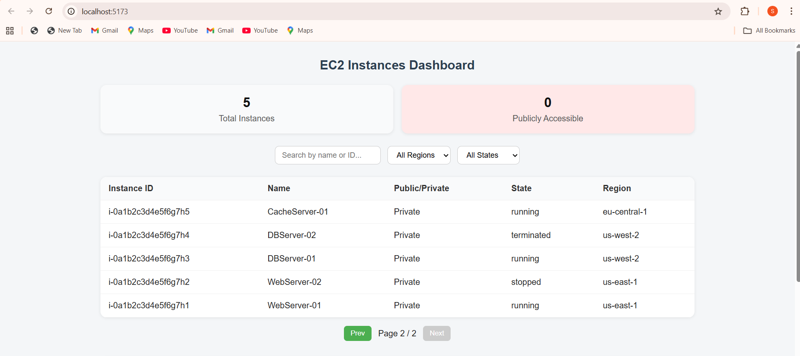
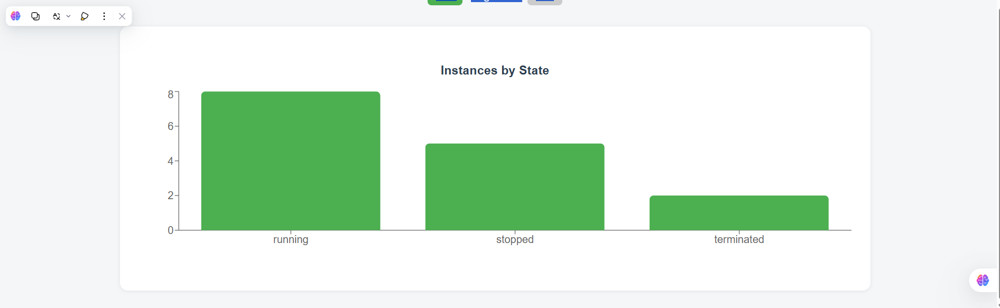

# EC2 Instances Dashboard

A full-stack dashboard to view and visualize EC2 instances. Built with **React** (frontend) and **Node.js + Express + MySQL** (backend).  
## Dashboard Preview




---

## Features

- View EC2 instances with pagination
- Filter by **region**, **state**, or **search by name/ID**
- Summary cards: **total instances** and **publicly accessible**
- Bar chart visualization of instances by state
- Sync live instances from AWS (requires credentials)
- **REST APIs** for instances, summary, regions, and AWS sync

---

## Prerequisites

- Node.js >= 18
- npm
- MySQL 8+
- AWS account (optional for sync)

---

## Backend Setup

1. Navigate to the backend folder:

```bash
cd backend


Create a .env file in the backend folder:
PORT=5000
DB_HOST=localhost
DB_USER=root
DB_PASSWORD=your_mysql_password
DB_NAME=ec2_dashboard
AWS_ACCESS_KEY_ID=your_aws_access_key
AWS_SECRET_ACCESS_KEY=your_aws_secret_key
AWS_REGION=ap-south-1

Create the MySQL database and table
CREATE DATABASE ec2_dashboard;
USE ec2_dashboard;

CREATE TABLE ec2_instances (
    id INT AUTO_INCREMENT PRIMARY KEY,
    instance_id VARCHAR(100) UNIQUE,
    name VARCHAR(100),
    state VARCHAR(50),
    region VARCHAR(50),
    public_ip VARCHAR(50),
    account_id VARCHAR(50),
    created_at TIMESTAMP DEFAULT CURRENT_TIMESTAMP,
    updated_at TIMESTAMP DEFAULT CURRENT_TIMESTAMP ON UPDATE CURRENT_TIMESTAMP
);

npm run dev

Backend runs at: http://localhost:5000

Backend API
Method	Endpoint	Description
GET	/api/instances	Fetch instances with filters & pagination
GET	/api/instances/summary	Fetch instance count grouped by state
GET	/api/regions	Fetch all distinct regions
POST	/api/instances/sync	Sync instances from AWS (requires AWS creds)

Example Request:
GET http://localhost:5000/api/instances?page=1&limit=10&state=running&region=ap-south-1&search=web

Frontend Setup

Navigate to the frontend folder:

cd frontend


Install dependencies:

npm install


Set the backend API URL in src/config/apiConfig.js:

export const BASE_URL = "http://localhost:5000/api";


Start the frontend:

npm run dev


Frontend runs at: http://localhost:5173